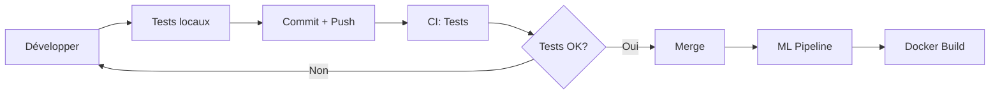

# 📦 Fichiers CI/CD Créés

## ✅ Ce qui a été ajouté

### 1. Tests Unitaires (`tests/`)
```
tests/
├── __init__.py
├── conftest.py                          # Fixtures partagées
├── README.md                             # Documentation des tests
├── test_data_loader.py                   # Tests du data loader
├── test_feature_engineering/
│   ├── __init__.py
│   ├── test_recipe_features.py
│   ├── test_nutrition_features.py
│   └── test_time_features.py
├── test_modeling/
│   ├── __init__.py
│   ├── test_recipe_clustering.py
│   ├── test_nutrition_classifier.py
│   └── test_time_predictor.py
└── test_scripts/
    ├── __init__.py
    └── test_clean_data.py
```

### 2. GitHub Actions Workflows (`.github/workflows/`)
```
.github/workflows/
├── ci.yml                    # Tests + Linting à chaque push
├── ml-pipeline.yml           # Pipeline ML complet
└── docker.yml               # Build et push Docker
```

### 3. Scripts Utilitaires (`scripts/`)
```
scripts/
├── download_kaggle_data.py   # Télécharge dataset depuis Kaggle
├── setup_cicd.sh            # Setup initial du CI/CD
└── verify_cicd_setup.py     # Vérifie la configuration
```

### 4. Documentation
```
.github/CI_CD_GUIDE.md       # Guide complet CI/CD
tests/README.md               # Guide des tests
QUICKSTART_CICD.md           # Démarrage rapide
```

### 5. Configuration
```
pyproject.toml               # Mis à jour avec pytest et coverage
Makefile                     # Commandes make pour tout
.gitignore                   # Mis à jour pour tests
```

---

## 🚀 Commandes Rapides

### Setup Initial
```bash
# Installation complète
make install-dev

# Setup CI/CD avec vérification
bash scripts/setup_cicd.sh

# Vérifier la configuration
python scripts/verify_cicd_setup.py
```

### Tests
```bash
make test           # Tous les tests
make test-cov       # Avec couverture
pytest tests/ -v    # Verbose
```

### Pipeline ML
```bash
make download-data  # Télécharger depuis Kaggle
make pipeline       # Pipeline complet
```

### Docker
```bash
make docker-build   # Build l'image
make docker-up      # Démarrer
make docker-down    # Arrêter
```

---

## ⚙️ Configuration GitHub Secrets

**IMPORTANT**: Avant de lancer les workflows, configurez ces secrets:

1. **Aller sur GitHub**: `Settings` → `Secrets and variables` → `Actions`

2. **Créer les secrets**:
   - `KAGGLE_USERNAME`: Votre username Kaggle
   - `KAGGLE_KEY`: Votre clé API Kaggle

3. **Obtenir les credentials Kaggle**:
   - Aller sur https://www.kaggle.com/account
   - Section "API" → "Create New API Token"
   - Télécharge `kaggle.json`:
     ```json
     {
       "username": "votre_username",
       "key": "votre_clé_api"
     }
     ```

---

## 📊 Workflows GitHub Actions

### 1. CI - Tests et Linting
- **Déclencheur**: Push/PR sur `main` et `develop`
- **Durée**: ~5-10 minutes
- **Actions**:
  - Tests sur Python 3.9, 3.10, 3.11
  - Linting (ruff, black)
  - Couverture de code
  - Upload vers Codecov

### 2. ML Pipeline
- **Déclencheur**: 
  - Manuel (workflow_dispatch)
  - Chaque dimanche à 2h
  - Push sur `main` (fichiers `src/`, `scripts/`)
- **Durée**: ~60-120 minutes
- **Pipeline**:
  1. Télécharge données Kaggle
  2. Clean data
  3. Recipe pipeline
  4. Nutrition classification
  5. Nutrition tagging
  6. Time prediction
  7. Sentiment analysis
- **Artefacts**: Modèles sauvegardés 30 jours

### 3. Docker Build
- **Déclencheur**: 
  - Push sur `main`
  - Tags `v*`
  - PR (test only)
- **Actions**:
  - Build image Docker
  - Push vers GitHub Container Registry
  - Test de l'image

---

## 🎯 Workflow de Développement



**Étapes détaillées**:

1. **Créer branche**
   ```bash
   git checkout -b feature/ma-feature
   ```

2. **Développer et tester localement**
   ```bash
   make test
   ```

3. **Commit et push**
   ```bash
   git add .
   git commit -m "feat: description"
   git push origin feature/ma-feature
   ```

4. **Créer Pull Request**
   - CI s'exécute automatiquement
   - Vérifier les résultats

5. **Après merge vers `main`**
   - ML Pipeline s'exécute (si fichiers modifiés)
   - Docker Build s'exécute

---

## 📈 Monitoring

### Voir les workflows
1. GitHub → Tab "Actions"
2. Sélectionner un workflow
3. Cliquer sur un run pour voir les logs

### Télécharger artefacts
1. Actions → Workflow run
2. Scroll → Section "Artifacts"
3. Télécharger les modèles/rapports

### Badges dans README
```markdown
[](https://github.com/tahianahajanirina/mangetamain/actions)
[](https://codecov.io/gh/tahianahajanirina/mangetamain)
```

---

## 🐛 Troubleshooting

### Tests échouent en local
```bash
# Réinstaller
pip install -e ".[dev,test]"

# Vérifier installation
python scripts/verify_cicd_setup.py
```

### Kaggle API ne fonctionne pas
```bash
# Vérifier credentials
cat ~/.kaggle/kaggle.json
chmod 600 ~/.kaggle/kaggle.json

# Tester
python -c "import kaggle; print('OK')"
```

### Import errors dans tests
```bash
# Vérifier que src est installé
pip list | grep recipe-ml
python -c "import src; print(src.__file__)"
```

### Docker build lent
```bash
# Utiliser le cache
docker build --cache-from recipe-ml:latest -t recipe-ml:latest .
```

---

## 📚 Documentation Complète

| Document | Description |
|----------|-------------|
| `.github/CI_CD_GUIDE.md` | Guide détaillé CI/CD |
| `tests/README.md` | Guide des tests unitaires |
| `QUICKSTART_CICD.md` | Démarrage rapide |
| `SETUP_GUIDE.md` | Setup du projet |

---

## ✅ Checklist de Déploiement

- [ ] Tests unitaires passent localement
- [ ] Secrets GitHub configurés (KAGGLE_USERNAME, KAGGLE_KEY)
- [ ] Workflows GitHub Actions présents
- [ ] `.gitignore` mis à jour
- [ ] Documentation à jour
- [ ] Branch protection rules configurées (optionnel)
- [ ] Codecov configuré (optionnel)

---

## 🎉 Prochaines Étapes

1. **Commit et push**:
   ```bash
   git add .
   git commit -m "feat: add CI/CD pipeline and tests"
   git push origin develop
   ```

2. **Vérifier CI**:
   - Aller sur GitHub Actions
   - Voir les tests s'exécuter

3. **Lancer ML Pipeline**:
   - Actions → "ML Pipeline - Full Training"
   - Run workflow

4. **Vérifier Docker**:
   - Actions → "Docker Build and Push"
   - Vérifier l'image publiée

---

**Créé le**: 2025-10-28  
**Version**: 1.0.0  
**Auteur**: GitHub Copilot
