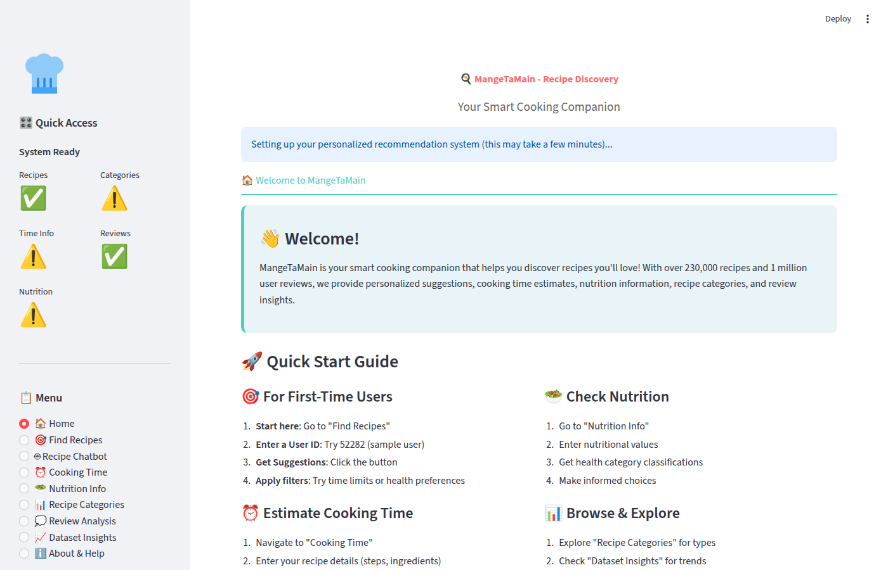
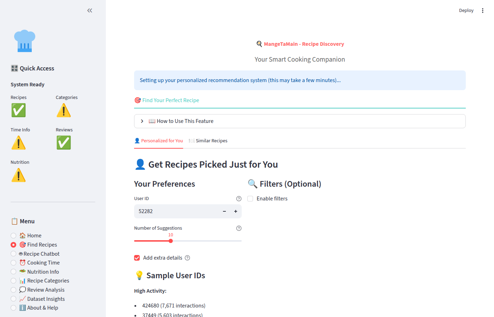

<div align="center">
  <h1>🍽️ MangetaMain — Recommandation de Recettes par Machine Learning</h1>
  <p><b>Plateforme ML complète pour recommander des recettes personnalisées.</b></p>
  <p>
    
    
    
    
    
    
    
    
  </p>
</div>

<br>

> **Projet réalisé par [Tahiana Hajanirina Andriambahoaka](https://github.com/tahianahajanirina), [Ahmed Fakhfakh](https://github.com/Ahmedfekhfakh), [Antoine Le Fèvre](https://github.com/A-Le-F) et [Oussama Rhouma](https://github.com/oussama10rhouma)**
> dans le cadre du cours *DATA706 — Bases de Données et Analyse* à Télécom Paris · Institut Polytechnique de Paris · Octobre 2025

---

## 📌 À propos du projet

**MangetaMain** est un système de recommandation de recettes de bout en bout, construit dans le cadre du cours **DATA706 — Télécom Paris** (Octobre-Novembre 2025). Le projet transforme **230 000+ recettes** et **1 000 000+ avis utilisateurs** du dataset Food.com en recommandations personnalisées grâce à un pipeline ML complet.

Le système combine **6 approches de Machine Learning** distinctes :

1. **Clustering K-Means** — Segmentation des recettes par profil nutritionnel, complexité et temps de cuisson (PCA + silhouette score)
2. **Analyse nutritionnelle** — Classification multi-label (6 tags binaires) et multi-classe (4 catégories) via RandomForest et GradientBoosting
3. **Analyse de sentiment** — Classification des avis utilisateurs (Positif / Neutre / Négatif) par Transformers fine-tunés (DistilBERT / RoBERTa)
4. **Chatbot RAG** — Assistant culinaire conversationnel avec retrieval augmenté, propulsé par Google Gemini 2.0 Flash
5. **Recommandation collaborative (SVD)** — Factorisation matricielle de la matrice creuse utilisateurs × recettes (k=50 facteurs latents)
6. **Prédiction du temps de cuisson** — Régression multi-modèle (Ridge, RandomForest, GradientBoosting) avec 20+ features extraites

---

## 🖼️ Aperçu

<div align="center">
  
  <p><em>Page d'accueil — Quick Start Guide, statut du système, menu de navigation</em></p>
</div>

<div align="center">
  
  <p><em>Recommandation personnalisée — User ID, filtres optionnels, suggestions SVD</em></p>
</div>

---

## ✨ Fonctionnalités clés

| Fonctionnalité | Description |
|:---|:---|
| **Recommandations personnalisées (SVD)** | Factorisation matricielle sur 1M+ interactions pour prédire les recettes qu'un utilisateur aimera |
| **Recommandations par similarité** | Trouver des recettes similaires via clustering et distance dans l'espace des features |
| **Classification nutritionnelle** | 6 tags binaires (high protein, low fat, low sugar…) + 4 catégories (Very Healthy → Indulgent) |
| **Prédiction du temps de cuisson** | Estimation du temps de préparation à partir des étapes, ingrédients et verbes de cuisson |
| **Clustering des recettes** | Segmentation automatique en groupes interprétables (Quick & Simple, Healthy, Elaborate…) |
| **Analyse de sentiment** | Classification des avis en Positif / Neutre / Négatif via DistilBERT / RoBERTa |
| **Chatbot culinaire RAG** | Assistant conversationnel qui recherche dans la base de recettes et génère des réponses contextualisées |
| **Exploration du dataset** | Visualisations interactives Plotly : distributions, tendances, corrélations nutritionnelles |

---

## 🏗️ Architecture

```
┌──────────────────────────────────────────────────────────────────┐
│                         DONNÉES BRUTES                           │
│         Food.com : 230K recettes + 1M interactions               │
└───────────────────────────┬──────────────────────────────────────┘
                            │
                            ▼
            ┌───────────────────────────────┐
            │     CHARGEMENT & CACHE        │
            │   DataCache (Singleton)       │
            │   Chargement sélectif         │
            │   Optimisation mémoire        │
            └───────────────┬───────────────┘
                            │
              ┌─────────────┴──────────────┐
              │                            │
              ▼                            ▼
┌──────────────────────┐     ┌──────────────────────────┐
│ FEATURE ENGINEERING  │     │    PRÉTRAITEMENT         │
│ • Time features      │     │ • Conversion de types    │
│ • Nutrition features │     │ • Valeurs manquantes     │
│ • Recipe features    │     │ • Filtrage qualité       │
│ • User features      │     │ • safe_eval() pour listes│
└──────────┬───────────┘     └──────────┬───────────────┘
           │                            │
           └──────────┬─────────────────┘
                      │
    ┌─────────────────┼──────────────────────┐
    │                 │                      │
    ▼                 ▼                      ▼
┌──────────┐   ┌────────────┐   ┌────────────────────┐
│ MODÈLES  │   │ RECOMMAND. │   │ NLP & CHATBOT      │
│ ML       │   │            │   │                    │
│ • K-Means│   │ • SVD      │   │ • Sentiment        │
│ • RF/GB  │   │ • Content  │   │   (Transformers)   │
│ • Ridge  │   │ • Hybrid   │   │ • RAG Chatbot      │
│          │   │            │   │   (Gemini API)     │
└────┬─────┘   └─────┬──────┘   └─────────┬──────────┘
     │               │                    │
     └───────────────┼────────────────────┘
                     │
                     ▼
      ┌──────────────────────────────┐
      │    PIPELINE INTÉGRÉ          │
      │  Composition des modèles     │
      │  Stratégies de fallback      │
      │  Cache & performance         │
      └──────────────┬───────────────┘
                     │
                     ▼
      ┌──────────────────────────────┐
      │   APPLICATION STREAMLIT      │
      │   8 pages interactives       │
      │   Visualisations Plotly      │
      │   Optimisé cloud (1GB RAM)   │
      └──────────────────────────────┘
```

---

## 🛠️ Stack technique

| Composant | Technologie | Rôle |
|:---|:---|:---|
| **ML & Data Science** | scikit-learn 1.7.2, pandas 2.3.3, numpy, scipy | Algorithmes ML (RandomForest, GradientBoosting, Ridge, K-Means, SVD) |
| **Deep Learning & NLP** | PyTorch 2.9.0, Transformers 4.57.1, HuggingFace Hub | Modèles de sentiment (DistilBERT, RoBERTa) |
| **Traitement de texte** | NLTK 3.9.2, TextBlob 0.19.0, textstat | Analyse linguistique des recettes et avis |
| **Clustering** | HDBSCAN 0.8.40, K-Means (scikit-learn) | Segmentation des recettes et utilisateurs |
| **Recommandation** | SVD (scipy.sparse.linalg), Surprise | Filtrage collaboratif par factorisation matricielle |
| **LLM / Chatbot** | Google Generative AI 0.8.5 (Gemini 2.0 Flash) | Chatbot RAG avec retrieval par mots-clés |
| **Interface Web** | Streamlit 1.50.0 | Application interactive (2 700 lignes) |
| **Visualisation** | Plotly 6.3.1, Matplotlib 3.10.7, Seaborn 0.13.2 | Graphiques interactifs et statistiques |
| **Tests** | pytest 7.3.0, pytest-cov | 124 tests unitaires avec fixtures partagées |
| **Qualité de code** | Black 23.0, Ruff 0.1.0 | Formatage (88 chars) et linting |
| **DevOps** | Docker, GitHub Actions (4 workflows), Make | CI/CD, conteneurisation, automatisation |

---

## 📊 Sources de données

| Donnée | Description |
|:---|:---|
| **RAW_recipes.csv** | 230 000+ recettes Food.com (2000-2018) — nom, ingrédients, étapes, nutrition, temps, tags |
| **RAW_interactions.csv** | 1 000 000+ avis utilisateurs — user_id, recipe_id, rating (0-5), review (texte), date |

**Source** : [Food.com Recipes and Interactions](https://www.kaggle.com/shuyangli94/food-com-recipes-and-user-interactions) — Shuyang Li (Kaggle)

Chaque recette contient :
- Liste d'ingrédients et étapes de préparation
- Temps de cuisson (minutes)
- Informations nutritionnelles : calories, lipides, sucre, sodium, protéines, graisses saturées, glucides
- Tags et catégories
- Avis et notes des utilisateurs

---

## 🤖 Machine Learning — Détail des modèles

### Clustering K-Means (Segmentation des recettes)

- **Algorithme** : K-Means avec optimisation par silhouette score (k ∈ [3, 10])
- **Prétraitement** : StandardScaler → PCA (90% de variance retenue)
- **Features** : `log_minutes`, `time_complexity`, `efficiency`, `health_category`
- **Résultat** : 6-8 clusters interprétables (Quick & Simple, Healthy & Balanced, Elaborate…)
- **Performance** : Silhouette ≥ 0.26

### Classification nutritionnelle

**Multi-label (Nutrition Tagger)** — 6 classifieurs binaires indépendants :
- `high_calorie` (> 500 cal), `low_calorie` (< 200 cal), `high_protein` (> 30g), `low_fat` (< 10g), `low_sugar` (< 10g), `healthy_recipe`
- Algorithmes : LogisticRegression, RandomForest, GradientBoosting
- Validation croisée stratifiée 5-fold

**Multi-classe (Nutrition Classifier)** — 4 catégories :
- Very Healthy → Healthy → Moderate → Indulgent
- RandomForest (200 arbres, `class_weight='balanced'`), 28 features
- F1-macro sur CV stratifiée

### Prédiction du temps de cuisson

- **Modèles comparés** : Linear, Ridge (α=1.0), RandomForest (100 arbres), GradientBoosting
- **Features** : 20+ features (n_steps, n_ingredients, cooking_verb_count, equipment_count, text complexity…)
- **Performance** : MAE ~5-8 min, R² ~0.78-0.82 (RandomForest)

### Recommandation collaborative (SVD)

- **Matrice** : Utilisateurs × Recettes (matrice creuse, 1M+ interactions)
- **Factorisation** : A ≈ U·S·Vᵀ avec k=50 facteurs latents
- **Prédiction** : R̂ = U·S·Vᵀ → top-N recettes non notées
- **Cold-start** : Fallback sur les recettes populaires

### Analyse de sentiment (Transformers)

- **Modèles** : DistilBERT (`distilbert-base-uncased-finetuned-sst-2-english`), RoBERTa
- **Classes** : Positif, Neutre, Négatif
- **Intégration** : HuggingFace Hub, checkpoints sauvegardés dans `outputs/sentiment_model/`

### Chatbot RAG (Gemini)

- **LLM** : Google Gemini 2.0 Flash (Experimental)
- **Retrieval** : Recherche par mots-clés dans la base de recettes (top-k)
- **Génération** : Réponse contextualisée avec l'historique de conversation (max 10 messages)

---

## 🚀 Infrastructure / Lancement

### Prérequis

- Python 3.9+
- 4 Go RAM minimum (8 Go recommandé)

### Installation et lancement

```bash
# Cloner le dépôt
git clone https://github.com/tahianahajanirina/mangetamain.git
cd mangetamain

# Installer les dépendances
make install
# ou : pip install -r requirements.txt

# Télécharger le dataset (nécessite les credentials Kaggle)
make download-data

# Lancer l'application
streamlit run streamlit_app_final.py
# ou : make app
```

### Docker

```bash
# Build et lancement
make docker-up

# ou manuellement
docker-compose up -d
```

### Pipelines ML

```bash
# Pipeline complet
make pipeline

# Ou individuellement
python main_time_prediction.py        # Prédiction du temps
python main_nutrition_tagging.py      # Classification nutritionnelle
python train_sentiment_model.py       # Entraînement sentiment
```

---

## 📁 Structure du projet

| Dossier / Fichier | Description |
|:---|:---|
| `src/preprocessing/data_loader.py` | Chargement des CSV bruts, conversion de types, `safe_eval()` pour les listes |
| `src/feature_engineering/time_features.py` | 20+ features temporelles (verbes de cuisson, équipements, complexité textuelle) |
| `src/feature_engineering/nutrition_features.py` | 25+ features nutritionnelles (ratios macro, PDV%, scores de santé) |
| `src/feature_engineering/recipe_features.py` | Features pour clustering K-Means (log_minutes, efficiency, health_category) |
| `src/feature_engineering/nutrition_classification_features.py` | 28 features pour classification multi-classe (4 catégories nutrition) |
| `src/feature_engineering/user_features.py` | Profils utilisateurs agrégés (préférences, ratings, temps de cuisson) |
| `src/modeling/recipe_clustering.py` | K-Means avec PCA, sélection automatique de k, nommage intelligent des clusters |
| `src/modeling/user_clustering.py` | Segmentation des utilisateurs par préférences culinaires |
| `src/modeling/time_predictor.py` | Régression multi-modèle (Linear, Ridge, RF, GB) avec cross-validation |
| `src/modeling/nutrition_tagger.py` | Classification multi-label binaire (6 tags nutritionnels) |
| `src/modeling/nutrition_classifier.py` | Classification multi-classe (4 catégories : Very Healthy → Indulgent) |
| `src/recommendation/svd_recommender.py` | Filtrage collaboratif SVD (k=50 facteurs, matrice creuse) |
| `src/recommendation/recipe_recommender.py` | Recommandation content-based par similarité de features |
| `src/recommendation/data_processor.py` | Construction de la matrice creuse utilisateurs × recettes |
| `src/integration/recommendation_pipeline.py` | Pipeline unifié combinant SVD, clustering, nutrition et sentiment |
| `src/integration/unified_data_loader.py` | Interface unifiée de chargement avec cache |
| `src/sentiment_analysis/` | Analyse de sentiment par Transformers (DistilBERT / RoBERTa) |
| `src/chatbot/rag_chatbot.py` | Chatbot RAG avec Google Gemini 2.0 Flash |
| `src/eda/visualization.py` | Fonctions de visualisation EDA (distributions, corrélations, tendances) |
| `src/utils/data_cache.py` | Cache singleton avec optimisation mémoire pour Streamlit Cloud |
| `config/config.py` | Configuration centralisée (chemins, hyperparamètres, seuils) |
| `streamlit_app_final.py` | Application Streamlit principale (2 700 lignes, 8 pages) |
| `Makefile` | 12+ commandes d'automatisation (install, test, pipeline, docker…) |
| `Dockerfile` / `docker-compose.yml` | Conteneurisation multi-stage |
| `.github/workflows/` | 4 workflows CI/CD (CI, ML pipeline, Docker, tests) |

---

## 🧪 Tests

**124 tests** couvrant l'ensemble du pipeline ML :

| Fichier de test | Module testé | Description |
|:---|:---|:---|
| `tests/conftest.py` | — | 6 fixtures partagées (sample_recipes_df, sample_interactions_df…) |
| `tests/test_data_loader.py` | `preprocessing` | Chargement des données, conversion de types |
| `tests/test_data_cache.py` | `utils` | Cache singleton, optimisation mémoire |
| `tests/test_feature_engineering/test_time_features.py` | `feature_engineering` | Features temporelles (verbes, équipements, complexité) |
| `tests/test_feature_engineering/test_nutrition_features.py` | `feature_engineering` | Features nutritionnelles (ratios, PDV%, scores) |
| `tests/test_feature_engineering/test_recipe_features.py` | `feature_engineering` | Features pour clustering (log_minutes, efficiency) |
| `tests/test_feature_engineering/test_nutrition_classification.py` | `feature_engineering` | Features multi-classe (28 features, 4 catégories) |
| `tests/test_feature_engineering/test_user_features.py` | `feature_engineering` | Profils utilisateurs agrégés |
| `tests/test_modeling/test_time_predictor.py` | `modeling` | Régression (train, predict, evaluate, cross-validate) |
| `tests/test_modeling/test_nutrition_tagger.py` | `modeling` | Classification multi-label (6 tags binaires) |
| `tests/test_modeling/test_nutrition_classifier.py` | `modeling` | Classification multi-classe (4 catégories) |
| `tests/test_modeling/test_recipe_clustering.py` | `modeling` | K-Means + PCA (fit, predict, silhouette) |
| `tests/test_modeling/test_user_clustering.py` | `modeling` | Segmentation utilisateurs |
| `tests/test_recommendation/test_svd_recommender.py` | `recommendation` | SVD collaboratif (factorisation, prédiction, top-N) |
| `tests/test_recommendation/test_data_processor.py` | `recommendation` | Matrice creuse, mapping IDs |
| `tests/test_scripts/test_clean_data.py` | `scripts` | Nettoyage des données brutes |

```bash
# Lancer tous les tests
make test

# Avec couverture
make test-cov

# Tests spécifiques
pytest tests/test_modeling/test_time_predictor.py -v
```

---

## 👥 Auteurs

<div align="center">

| | Nom | GitHub |
|:---:|:---|:---|
| 👨‍💻 | **Tahiana Hajanirina ANDRIAMBAHOAKA** | [@tahianahajanirina](https://github.com/tahianahajanirina) |
| 👨‍💻 | **Ahmed FAKHFAKH** | [@Ahmedfekhfakh](https://github.com/Ahmedfekhfakh) |
| 👨‍💻 | **Antoine LE FEVRE** | [@A-Le-F](https://github.com/A-Le-F) |
| 👨‍💻 | **Oussama RHOUMA** | [@oussama10rhouma](https://github.com/oussama10rhouma) |

</div>

---

<div align="center">

**Projet réalisé dans le cadre du cours DATA706 — Télécom Paris**

**Octobre – Novembre 2025**

*Machine Learning appliqué à la recommandation de recettes*

</div>
