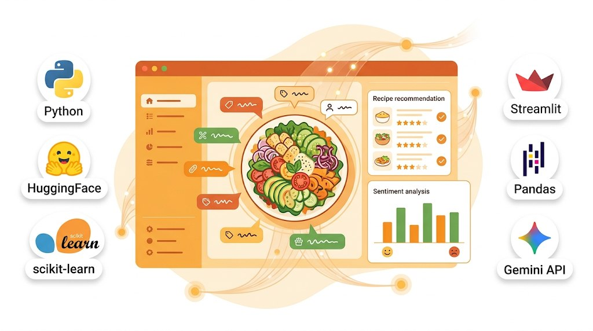

<div align="center">
  
  <h1>🍽️ MangetaMain — Recommandation de Recettes par Machine Learning</h1>
  <p><b>Plateforme ML complète pour recommander des recettes personnalisées.</b></p>
</div>

> **Projet réalisé par [Tahiana Hajanirina Andriambahoaka](https://github.com/tahianahajanirina), [Ahmed Fakhfakh](https://github.com/Ahmedfekhfakh), [Antoine Le Fèvre](https://github.com/A-Le-F) et [Oussama Rhouma](https://github.com/oussama10rhouma)**

---

## 📌 À propos du projet

**MangetaMain** est un système de recommandation de recettes de bout en bout basé sur un pipeline ML complet (recommandation SVD, clustering, classification nutritionnelle, prédiction du temps, sentiment, chatbot RAG).

## 🚀 Lancement rapide

```bash
git clone https://github.com/tahianahajanirina/mangetamain.git
cd mangetamain
make install
make download-data
make app
```

## 🧪 Tests

```bash
make test
make test-cov
```

## 📁 Structure

Le projet est organisé autour de `src/` (préprocessing, feature_engineering, modeling, recommendation, chatbot), `config/`, `tests/`, et `streamlit_app_final.py`.

## 👥 Auteurs

- Tahiana Hajanirina ANDRIAMBAHOAKA
- Ahmed FAKHFAKH
- Antoine LE FEVRE
- Oussama RHOUMA

